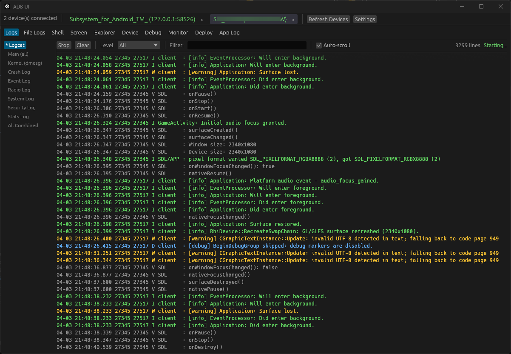

# ADB UI (`adb-ui-rs`)

`adb-ui-rs` is a debugging focused desktop GUI for common ADB(Android Debug Bridge) workflows, built with Rust and `eframe`/`egui`.

It gives each connected Android device or emulator its own workspace for logs, shell access, file browsing, screenshots, debugging, monitoring, and app-focused deployment tasks.



## Features

- Live `logcat` streaming with filters and multiple buffer views
- Per-device logcat filtering by text, priority, tag, and PID
- App file log pulling and live watching
- Interactive device shell
- Screenshot capture and screen recording
- Remote file explorer with upload, download, preview, and delete actions
- Device and app management actions
- Package management helpers for package listing, split APK installs, permission grant/revoke, enable/disable, clear data, and force-stop
- Port forwarding, reverse forwarding, Wi-Fi ADB pairing, and ADB server controls
- Debugging and profiling helpers built around `dumpsys`, `atrace`, `simpleperf`, and `strace`
- Explicit memory allocation tracking, heap-watch controls, and managed/native heap dumps
- Developer command surfaces for `am`, `pm`, `wm`, `settings`, `cmd`, `content`, and SQLite access through `run-as`
- OTA sideload and fastboot flash companion tooling
- System monitoring views for processes, CPU, storage, battery, thermal, I/O, and services
- App data deployment to external storage or app-internal storage through `run-as`
- Emulator, Wi-Fi ADB, and WSA helpers

## Requirements

- Rust `1.92` or newer
- A working `adb` installation
- Android SDK tools for emulator and AVD features such as `emulator`, `avdmanager`, and `sdkmanager`

Notes:

- The app looks for `adb` on `PATH` first.
- If autodetection fails, the Settings panel can be used to point the app to the `adb` executable.
- Some features depend on device-side tooling and permissions. Internal file access and internal deploys typically require `run-as <package>` to work, which usually means the target app is installed as debuggable.

## Quick Start

Clone the repository and run the app:

```bash
git clone https://github.com/mq1n/adb-ui-rs
cd adb_log_viewer
cargo run
```

Build a release binary:

```bash
cargo build --release
```

On Windows, the release binary is:

```text
target/release/adb-ui-rs.exe
```

### Linux build dependencies

The project also builds on Linux in CI. On Ubuntu or Debian-based systems, install:

```bash
sudo apt-get update
sudo apt-get install -y libgtk-3-dev libxdo-dev libdbus-1-dev
```

If you build inside WSL, use a current Rust toolchain from `rustup` (or another Rust `1.92+` install). Older distro-packaged Cargo versions such as Ubuntu's `1.75` cannot read this repository's `Cargo.lock` v4.

## Configuration

The app stores configuration in a per-user config directory:

- Windows: `%APPDATA%/adb-ui-rs/adb-ui-rs.json`
- Linux: `$XDG_CONFIG_HOME/adb-ui-rs/adb-ui-rs.json` or `~/.config/adb-ui-rs/adb-ui-rs.json`
- macOS: `~/Library/Application Support/adb-ui-rs/adb-ui-rs.json`

If no user config exists yet, the app also loads a legacy `adb-ui-rs.json` placed next to the executable.

The main settings are:

- `bundle_id`
- `activity_class`
- `logcat_tags`
- `deploy_dirs`

Example:

```json
{
  "bundle_id": "com.example.app",
  "activity_class": "com.example.app/.MainActivity",
  "logcat_tags": [
    "SDL",
    "SDL/APP",
    "GameActivity",
    "NativeCrashReporter"
  ],
  "deploy_dirs": [
    {
      "label": "Game Paks",
      "local_path": "C:/game/pack",
      "remote_suffix": "pack"
    }
  ]
}
```

Notes:

- `activity_class` accepts either `.MainActivity`, `com.example.app.MainActivity`, or a full component such as `com.example.app/.MainActivity`.
- If `activity_class` is empty, launch actions fall back to `monkey`.
- If `logcat_tags` is empty, the app shows unfiltered `logcat` output instead of silently filtering everything out.
- Saving settings applies updated logcat tags and package settings immediately.
- `deploy_dirs` are read from the JSON config and used by the Deploy tab.

## Usage Overview

Each connected device gets its own tab. Inside each device tab, the app provides:

- `Logs`: live logcat and snapshot/watch support for additional log buffers
- `File Logs`: app log file collection from internal and external storage
- `Shell`: interactive shell session with command history
- `Screen`: screenshots, auto-capture, recording, export, and clipboard actions
- `Explorer`: remote file browsing and file operations
- `Device`: device info, app actions, package/network/content tools, OTA helpers, bugreport, UI dump, emulator helpers, and quick diagnostics
- `Debug`: focused debugging and profiling tools
- `Monitor`: system snapshots for common device diagnostics
- `Deploy`: push local directories into app storage
- `App Log`: internal log for the desktop app itself

The Settings panel also exposes global platform-tool workflows:

- `adb devices -l`
- `adb kill-server` / `adb start-server`
- `adb pair` for Android 11+ wireless debugging
- `fastboot devices` and partition flashing

## Storage Conventions

The project is package-oriented and commonly works with paths such as:

- `/sdcard/Android/data/<package>/files/...`
- `/sdcard/Android/data/<package>/files/logs/...`
- `files/...` through `run-as`
- `files/logs/...` through `run-as`

The Deploy tab supports two modes:

- External deploy via `adb push` into `/sdcard/Android/data/<package>/files/<suffix>`
- Internal deploy via staging to `/data/local/tmp/_adb_ui_stage` and copying into app storage with `run-as`

## Project Structure

- [`src/main.rs`](src/main.rs): native app entry point
- [`src/ui/`](src/ui): GUI modules for each tab and settings panel
- [`src/adb/`](src/adb): wrappers around `adb`, emulator, and shell commands
- [`src/device.rs`](src/device.rs): per-device state and feature categories
- [`src/config.rs`](src/config.rs): persisted application configuration
- [`.github/workflows/ci.yml`](.github/workflows/ci.yml): CI checks and release workflow

## Development

Useful commands:

```bash
cargo fmt --check
cargo clippy -- -W clippy::pedantic -W clippy::nursery -D warnings
cargo test
cargo build --release
```

CI runs formatting, clippy, and release builds.

## Contributing

Contributions are welcome.

If you plan to make a larger change, open an issue first or describe the direction clearly in the pull request so the scope and intent are easy to review.

Keep changes focused, avoid unrelated refactors, and update documentation when behavior changes.

## Pull Requests

For pull requests:

1. Fork the repository.
2. Create a focused branch for your change.
3. Make the change with clear commit messages.
4. Run the local checks:

   ```bash
   cargo fmt --check
   cargo clippy -- -W clippy::pedantic -W clippy::nursery -D warnings
   cargo test
   ```

5. Update `README.md` or related docs if the user-facing workflow changed.
6. Open a pull request with:
   - a short summary of the change
   - the motivation or problem being solved
   - testing notes
   - screenshots or recordings for UI changes, when relevant

## License

This project is licensed under the MIT License. See [LICENSE](LICENSE).
